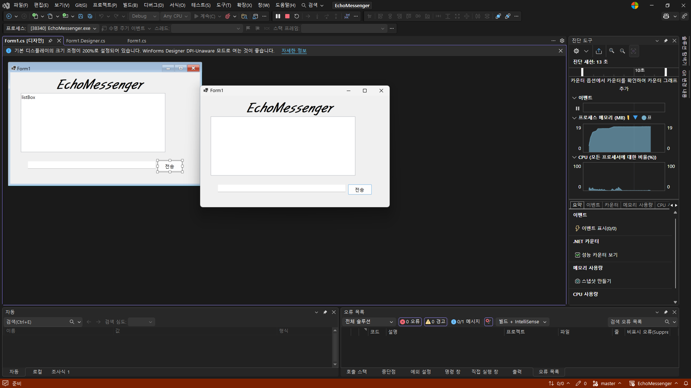
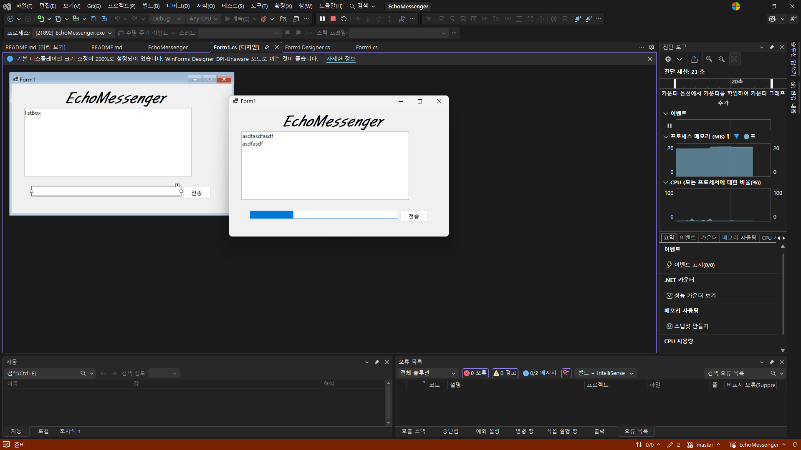
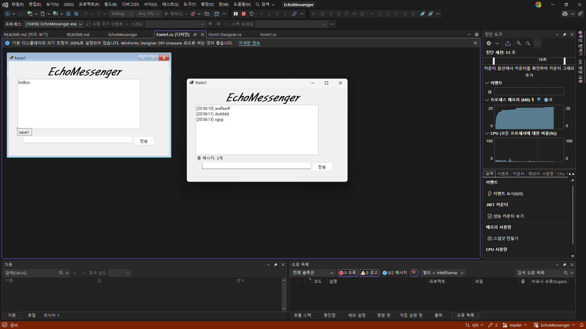
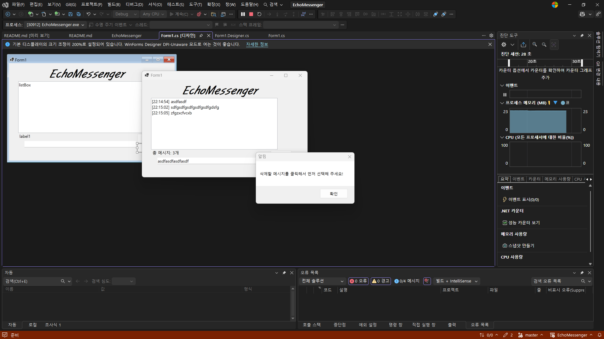

 # (C# 코딩) 에코메신저

 ## 개요
- C# 프로그래밍학습
- 핵심기능
- 실시간 에코 출력: 사용자가 입력한 메시지를 리스트 박스에 즉시 추가하여 대화 흐름을 시각화합니다.
- DateTime 기능을 활용해 모든 메시지 앞에 전송 시각(HH:mm:ss)을 자동으로 결합하여 출력합니다.
- Trim() 메서드로 앞뒤 불필요한 공백을 제거하고, 빈 문자열 전송을 원천 차단하여 데이터의 품질을 유지합니다.
- 퀵 전송(Enter Key): 마우스 클릭 없이 키보드 엔터(Enter) 키만으로 메시지 전송이 가능하며, 전송 시 발생하는 시스템 경고음을 제거했습니다.
- 스마트 포커스: 메시지 전송 직후 입력창을 자동으로 비우고(Clear), 커서를 입력창으로 즉시 이동(Focus)시켜 연속적인 대화를 지원합니다.
- 실시간 카운팅: 현재 리스트에 쌓인 총 메시지 개수를 하단 라벨에 실시간으로 업데이트하여 보여줍니다.
- 선택 항목 삭제: 리스트에서 특정 메시지를 선택해 개별적으로 삭제할 수 있으며, 항목 미선택 시 발생할 수 있는 오류를 **예외 처리(Exception Handling)**하여 경고 메시지를 띄웁니다.
- btnremoveall 버튼을 통해 모든 대화 기록을 한 번에 지울 수 있으며, 실수 방지를 위한 **확인 대화상자(Confirm Modal)**를 제공합니다.
- 글자 수 제한 및 차단: 메시지 길이를 50자 이하로 제한합니다. 초과 입력 후 전송 시도 시 경고 메시지("50자 이하만 입력해 주세요.")를 출력하고 전송을 차단하는 방어적 로직을 구현했습니다.

- 화면구성: 먼저 상단에는 메시지 입력을 위한 **텍스트 박스(txtBox)**와 전송을 실행하는 **버튼(btnInput)**이 가로로 나란히 배치되어 있습니다. 텍스트 박스는 사용자가 자유롭게 내용을 타이핑하는 공간이며, 전송 버튼은 입력된 데이터를 리스트로 전달하는 트리거 역할을 합니다. 특히 이 구역은 마우스 클릭뿐만 아니라 엔터 키 입력만으로도 전송이 가능하도록 설계되어 조작 속도를 높였습니다.중앙에는 프로그램의 핵심인 **리스트 박스(listBox)**가 화면의 가장 넓은 면적을 차지하며 배치되어 있습니다. 이곳은 사용자가 보낸 메시지가 전송 시각과 결합되어 위에서 아래 순서로 쌓이는 대화창 역할을 합니다. 사용자는 리스트 박스 내의 특정 항목을 마우스로 클릭하여 선택할 수 있으며, 이는 하단의 삭제 기능과 직접적으로 연동됩니다. 하단에는 데이터 관리를 위한 두 개의 제어 버튼이 위치합니다. **선택 삭제 버튼(btnremove)**은 중앙 리스트 박스에서 사용자가 클릭한 특정 메시지 하나만을 목록에서 제거하는 기능을 수행합니다. 그 옆의 **전체 삭제 버튼(btnremoveall)**은 현재까지 쌓인 모든 대화 기록을 한 번에 지우는 역할을 하며, 실수로 데이터를 날리는 것을 방지하기 위해 클릭 시 별도의 확인창을 띄우도록 구성되었습니다.
마지막으로 화면의 하단에는 프로그램의 상태를 알려주는 **상태 라벨(lblnum)**이 자리 잡고 있습니다. 이 라벨은 별도의 조작 없이도 현재 리스트 박스에 저장된 총 메시지의 개수를 "총 메시지: N개" 형태로 실시간 출력하여, 사용자가 데이터의 양을 즉각적으로 파악할 수 있도록 돕습니다.

 ## 실행화면
- 1단계코드의실행스크린샷

- 과제 내용
 - 라벨, 텍스트 박스, 버튼, 리스트 박스를 적절히 배치하여 에코 메신저의 기본적인 UI를 구성함.
 - 전송 버튼 클릭 시 텍스트 박스에 입력된 메시지를 리스트 박스에 추가하여 대화 내용을 표시함.
 - 추가 직후 텍스트 박스의 내용을 비워 다음 입력을 준비함. 

- 2단계코드의실행스크린샷

- 과제 내용
 - 전송이 끝나면 입력창에 남겨진 기존 메시지를 삭제하여 새로운 메시지를 입력할 수 있도록 함.
 - 전송 후에 마우스로 입력창을 다시 클릭하지 않아도 되도록 커서를 자동으로 입력창에 위치시킴.
 - 마우스 클릭 대신 키보드의 엔터 키를 눌러 메시지를 전송할 수 있도록 설정함.
 - 내용이 없는 빈 문자열이나 공백만 있을 때는 메시지가 전송되지 않도록 방지함.

- 3단계코드의실행스크린샷

- 과제 내용
 - 메시지 앞에 현재 시간을 자동으로 결합하여 리스트에 출력함.
 - 현재 리스트에 쌓인 총 메시지 개수를 계산하여 하단 라벨에 실시간으로 표시함
 - 사용자가 입력한 메시지의 앞뒤 불필요한 공백을 Trim() 메서드를 사용하여 제거하여 깔끔한 메시지 출력이 가능하도록 함.

- 4단계코드의실행스크린샷

- 과제 내용
 - 리스트 박스에서 특정 메시지를 마우스로 클릭하고 삭제 버튼을 누르면 해당 항목만 목록에서 제거함. 
 - 메시지를 마우스로 클릭하지 않고 삭제 버튼을 누를 시 사용자에게 경고 메시지를 띄움.
 - 대화 기록 삭제 버튼을 클릭하면 리스트의 모든 내용을 한 번에 지움. 
 - 입력창에 글자 수를 50자로 제한하고, 초과시 사용자에게 경고 메시지를 띄워 전송을 차단하게 함.

 ## 배운내용
- Label, TextBox, Button, ListBox 등 기본 컨트롤의 특성을 이해하고, 사용자 친화적인 인터페이스를 설계하는 방법을 익혔습니다.
- 이벤트 기반 프로그래밍: 사용자가 버튼을 클릭했을 때 특정 로직이 실행되는 이벤트를 연결하고, TextBox.Text 속성을 통해 데이터를 가져와 ListBox.Items.Add()로 전달하는 기본적인 데이터 흐름을 실습했습니다.
- 입력 편의성 향상: Focus() 메서드를 사용하여 전송 후 커서를 자동 배치하고, Clear()를 통해 입력창을 초기화하는 등 연속적인 입력이 가능한 환경을 구현했습니다.
- 키보드 이벤트 처리: KeyDown 이벤트를 활용하여 마우스 클릭 없이도 Enter 키만으로 메시지를 전송하는 로직을 구현했으며, SuppressKeyPress를 통해 엔터 입력 시 발생하는 시스템 경고음을 제어하는 법을 배웠습니다.
- string.IsNullOrWhiteSpace()를 사용하여 의미 없는 공백이나 빈 문자열이 전송되는 것을 방지하는 예외 처리를 학습했습니다.
- 리스트의 항목 수(Items.Count)를 추적하여 라벨에 실시간으로 표시함으로써 프로그램의 상태 정보를 사용자에게 즉각 전달하는 로직을 설계했습니다.
